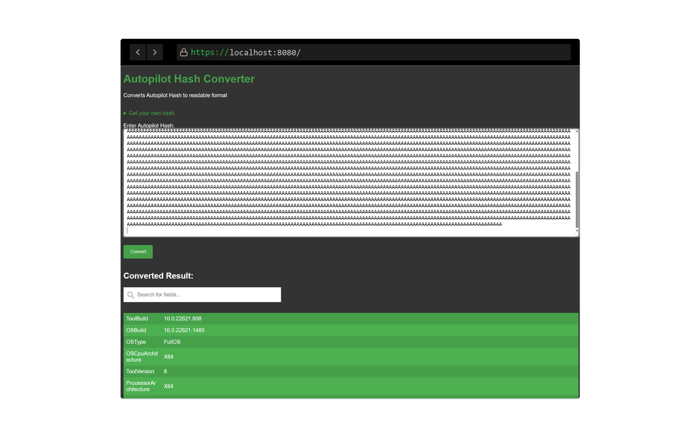

# Decode Autopilot hash

This web app takes a Autopilot hardware hash and decodes it.
If you need a test hash use your own.



With elevated permissions (as admin) in powershell, run

```powershell
 (Get-CimInstance -Namespace root/cimv2/mdm/dmmap -Class MDM_DevDetail_Ext01 -Filter "InstanceID='Ext' AND ParentID='./DevDetail'").DeviceHardwareData | clip
```

to copy your hash to the clipboard.

## Prerequisites

- Docker installed on your machine.

## Usage

1. Run the app with docker:

    ```bash
    docker run --rm --name decode_autopilot_hash -p 8080:5000 ghcr.io/mrwyss/decodeautopilothash:latest
    ```

2. Open your web browser and navigate to <http://localhost:8080>.

## Requirements

- docker

## License

This project is licensed under the [Creative Commons Attribution 4.0 International License](https://creativecommons.org/licenses/by/4.0/)

## Credits

This project is heavily based on Michael Niehaus’s [AutopilotUtility](https://www.powershellgallery.com/packages/AutopilotUtility).

Let me know if you have any questions or if there's anything else I can help you with!
